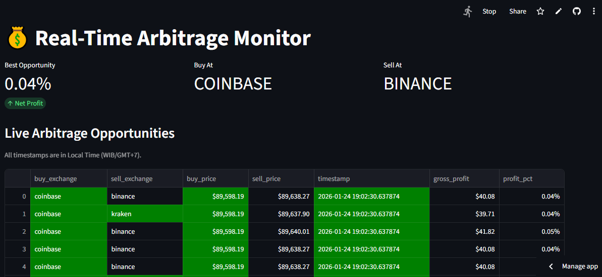

# Real-Time Crypto Arbitrage Monitor

### **[➡️ View the Live Demo](https://crypto-live-monitor-o4jcjabllzry7u8774jgrj.streamlit.app/)**

*   **Description**: An automated pipeline to detect Bitcoin price differences between Binance, Kraken, and Coinbase.
*   **Tech Stack**: Python, PostgreSQL (Neon), dbt, Streamlit.
*   **How it Works**: Fetches data every minute -> Calculates spread -> Displays profitable trades on Dashboard.
